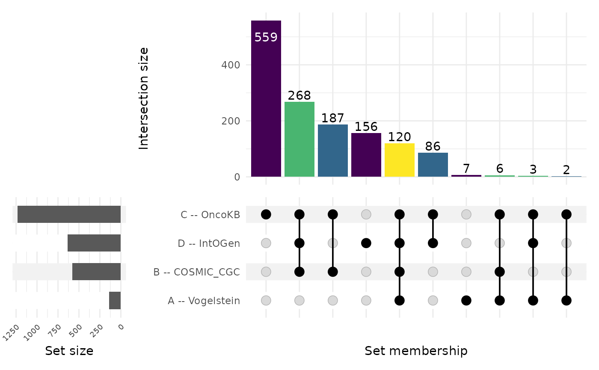
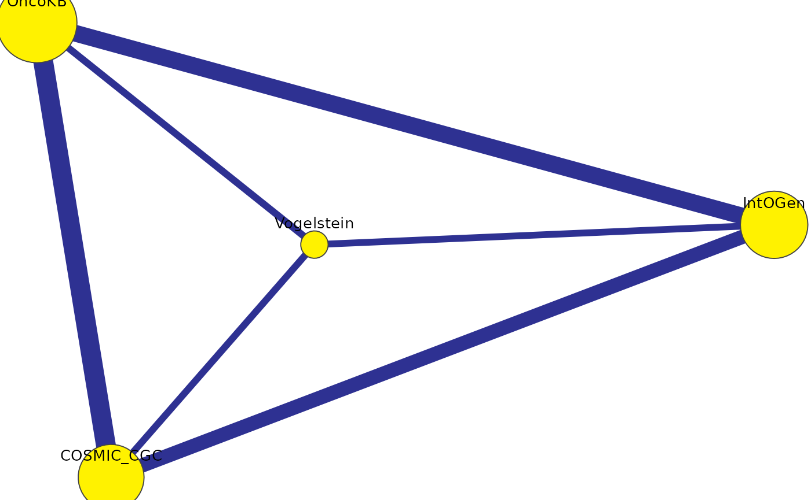

# Choosing UpSet vs Venn vs Network

## Choosing UpSet vs Venn vs Network

`vennDiagramLab` ships three complementary visualizations of the same
underlying region structure. This vignette explains when to use which.

``` r

library(vennDiagramLab)
result <- analyze(load_sample("dataset_real_cancer_drivers_4"))
length(result@dataset@set_names)
#> [1] 4
```

### Quick guidance

| \# of sets | Recommended primary view | Why |
|----|----|----|
| 2 | Venn | obvious, area-proportional possible |
| 3 | Venn | classic three-circle layout reads instantly |
| 4 | Venn (Edwards) | still readable as a Venn |
| 5–6 | UpSet | Venn becomes hard to read; UpSet bars are clearer |
| 7+ | UpSet (primary) + Network (relationships) | Venn is essentially unusable |

For high set counts (5+), the **Network** view adds something neither
representation provides: it shows the *pairwise* relationships as a
graph, where edge weight is intersection size or significance.

### Venn

``` r

svg <- render_venn_svg(result, title = "4-set Venn (cancer drivers)")
nchar(svg)
#> [1] 6473
```

The SVG is plain text — embed it in a notebook with
`htmltools::HTML(svg)` or save to disk and reference from Markdown.

### UpSet

``` r

render_upset(result, sort_by = "size", color_mode = "depth")
```



(The chunk above is gated on `R >= 4.6` because the CRAN release of
`ComplexUpset` (1.3.3) is incompatible with `ggplot2 >= 4.0` on older
R.)

### Network

``` r

render_network(result, edge_metric = "intersection")
```



Each node is a set, sized by inclusive cardinality. Each edge is a pair,
weighted by the chosen `edge_metric` (`"intersection"`, `"jaccard"`,
`"fold_enrichment"`, or `"overlap_coefficient"`). Edges below the
significance threshold are colored differently.

### When the three views disagree

Sometimes a region looks “small” on a Venn but lights up bright on a
Network because the *fold-enrichment* is high relative to expectation.
That’s not a contradiction — Venn shows raw counts, Network can show
normalized strength. Use both.

### What’s next

- [`vignette("v05_statistics_deep_dive")`](https://zoliqua.github.io/Venn-Diagram-Lab/r/articles/v05_statistics_deep_dive.md)
  — what the network’s significance threshold actually means.
- [`vignette("v07_pdf_reports")`](https://zoliqua.github.io/Venn-Diagram-Lab/r/articles/v07_pdf_reports.md)
  — generate a single PDF that includes all three views.
