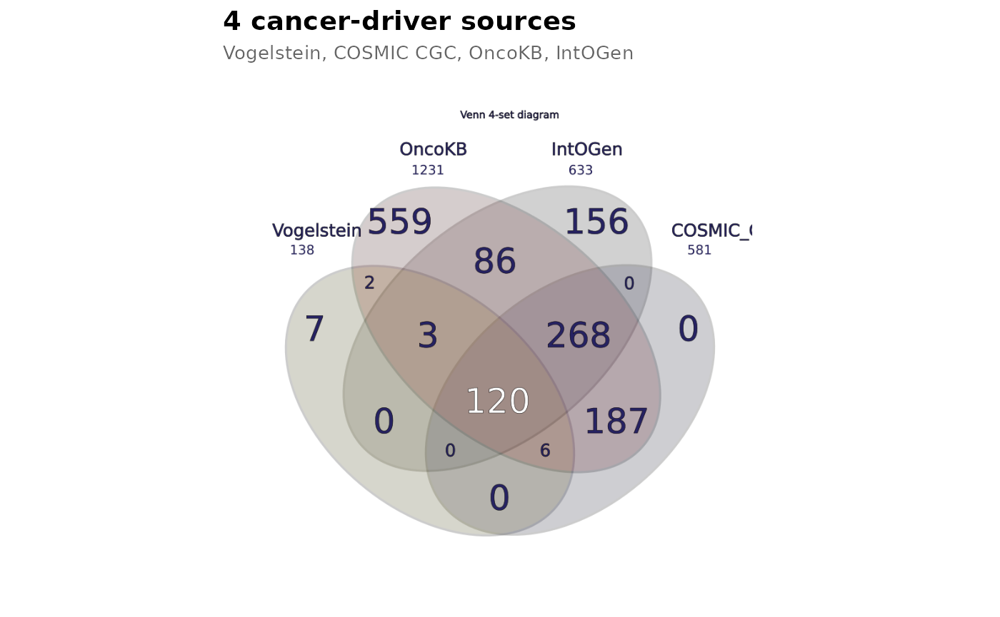

# Custom styling and export

## Custom styling and export

`vennDiagramLab` separates analysis from rendering. Once you have a
`RegionResult`, you can render it with custom names, custom colors,
post-process the SVG, embed it in a ggplot2 chain via
[`geom_venn()`](https://zoliqua.github.io/Venn-Diagram-Lab/r/reference/geom_venn.md),
or export to PNG / PDF.

``` r

library(vennDiagramLab)
result <- analyze(load_sample("dataset_real_cancer_drivers_4"))
```

### Custom names

Pass a per-letter mapping (`A`-`I`) to override the dataset’s set names:

``` r

svg <- render_venn_svg(
    result,
    set_names = c(A = "Vogelstein\n(2013)",
                   B = "COSMIC CGC",
                   C = "OncoKB",
                   D = "IntOGen"),
    title = "Pan-source cancer driver agreement"
)
substr(svg, 1, 60)
#> [1] "<?xml version=\"1.0\" encoding=\"UTF-8\"?>\n<!-- Created by Zolta"
```

### Custom colors

Pass a per-letter hex map. Each letter’s color is applied to the
matching shape AND the legend bullet (and, where present, the Euler
extra shape).

``` r

svg <- render_venn_svg(
    result,
    colors = c(A = "#E69F00", B = "#56B4E9", C = "#009E73", D = "#CC79A7")
)
nchar(svg)
#> [1] 6464
```

### Hide the count labels

``` r

svg_clean <- render_venn_svg(result, show_counts = FALSE)
nchar(svg_clean)
#> [1] 6425
```

(`show_names = FALSE` does the analogous thing for set names.)

### Post-render SVG manipulation with xml2

The returned SVG is a plain string; parse it with `xml2` to make
targeted edits (e.g. set the page background or add a watermark):

``` r

svg <- render_venn_svg(result)
doc <- xml2::read_xml(svg)
xml2::xml_attr(doc, "viewBox")
#> [1] "0 0 700 700"
```

### Embed in a ggplot2 chain

[`geom_venn()`](https://zoliqua.github.io/Venn-Diagram-Lab/r/reference/geom_venn.md)
returns a list of layers that draws the venn on a unit-square coordinate
system, ready to compose with titles, themes, and other annotations.

``` r

library(ggplot2)
ggplot() +
    geom_venn(data = result) +
    theme_void() +
    labs(title = "4 cancer-driver sources",
          subtitle = "Vogelstein, COSMIC CGC, OncoKB, IntOGen") +
    theme(plot.title = element_text(size = 14, face = "bold"),
          plot.subtitle = element_text(size = 10, colour = "grey40"))
```



### Multi-format export

[`render_venn_svg()`](https://zoliqua.github.io/Venn-Diagram-Lab/r/reference/render_venn_svg.md)
returns a string. Convert it to PNG or PDF via the `rsvg` package
(already a hard import of `vennDiagramLab`):

``` r

svg <- render_venn_svg(result)
png_path <- tempfile(fileext = ".png")
rsvg::rsvg_png(charToRaw(svg), png_path, width = 1200)
file.size(png_path)
#> [1] 206202

pdf_path <- tempfile(fileext = ".pdf")
rsvg::rsvg_pdf(charToRaw(svg), pdf_path)
file.size(pdf_path)
#> [1] 31926
```

For a multi-page composite report (venn + upset + statistics + network +
about), use
[`to_pdf_report()`](https://zoliqua.github.io/Venn-Diagram-Lab/r/reference/to_pdf_report.md)
— see
[`vignette("v07_pdf_reports")`](https://zoliqua.github.io/Venn-Diagram-Lab/r/articles/v07_pdf_reports.md).

### What’s next

- [`vignette("v01_quickstart")`](https://zoliqua.github.io/Venn-Diagram-Lab/r/articles/v01_quickstart.md)
  — basic usage.
- [`vignette("v04_upset_vs_venn_vs_network")`](https://zoliqua.github.io/Venn-Diagram-Lab/r/articles/v04_upset_vs_venn_vs_network.md)
  — alternative visualizations.
- [`vignette("v07_pdf_reports")`](https://zoliqua.github.io/Venn-Diagram-Lab/r/articles/v07_pdf_reports.md)
  — composite multi-page PDF reports.
